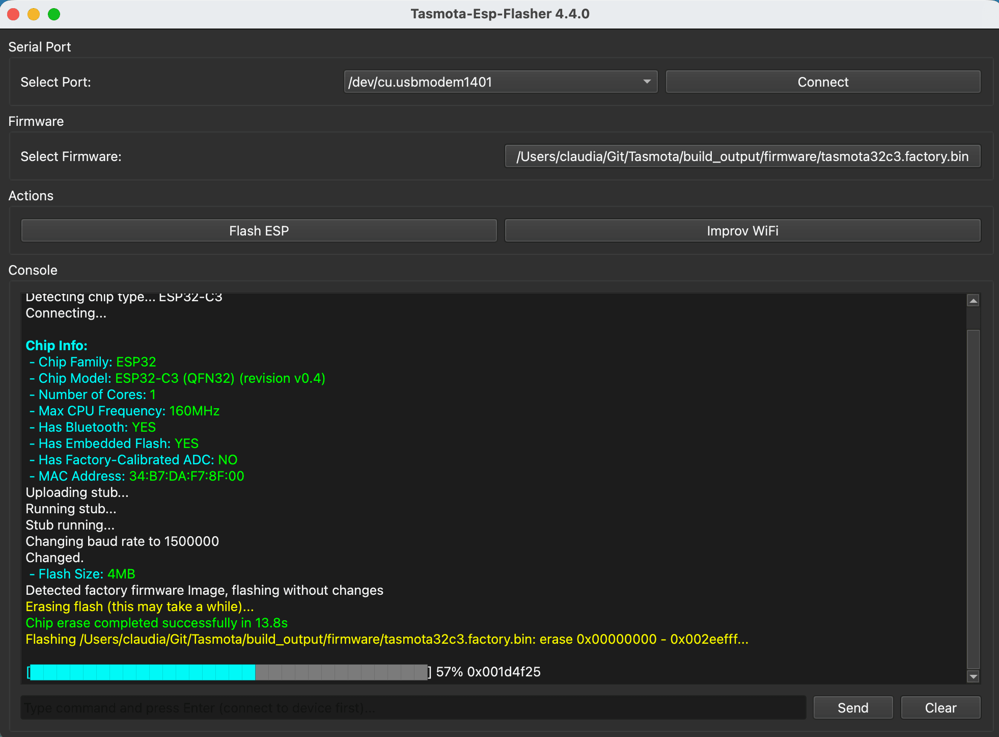
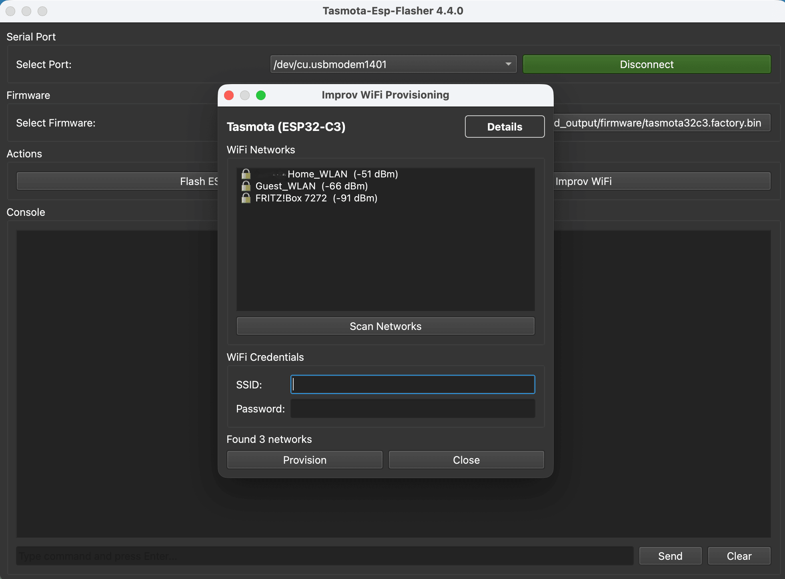

[](https://github.com/vshymanskyy/StandWithUkraine/blob/main/docs/README.md)

# Tasmota-ESP-Flasher for Tasmota v13 and later (Safeboot partition scheme)

[](https://github.com/Jason2866/ESP_Flasher/releases/latest)

Tasmota-ESP-Flasher is an app for ESP8266 / ESP32 designed to make flashing Tasmota on ESPs as simple as possible by:

 * Pre-built binaries for most used operating systems
 * Support for Tasmota factory images
 * Hiding all non-essential options for flashing
 * All necessary options (bootloader, flash mode, safeboot) are set automatically
 * Flashing is lightning fast
 * Full ANSI color support for colored terminal output
 * Interactive serial monitor with command input support

The flashing process is done using [esptool](https://github.com/espressif/esptool) from espressif.

## Installation

- Check the [releases section](https://github.com/Jason2866/ESP_Flasher/releases) for your OS.
- Download and double-click and it'll start.

- The native Python version can be installed from PyPI: **`pip install esp-flasher`**.
  Start the GUI by `esp_flasher`. Alternatively, you can use the command line interface ( type `esp_flasher -h` for info)

- Only Linux:
```bash
sudo usermod -a -G dialout $(whoami)
```
after the command has fired and a relogin the Flasher can access the serial ports and flash away

## Usage Guide

### Flash Process

The flashing process is straightforward and consists of a few simple steps:

#### 1. Select Serial Port
Connect your ESP device via USB and select the correct serial port from the dropdown menu.

#### 2. Connect to Device
Click the "Connect" button to establish a connection with your ESP device. The flasher will detect the chip type automatically.

#### 3. Select Firmware
Click "Select Firmware" to choose your Tasmota factory firmware file (.bin). The flasher automatically detects the chip type and configures all necessary parameters.

#### 4. Start Flashing
Click "Flash ESP" to begin the flashing process. The progress bar shows the current status.

#### 5. Flash Complete
Once flashing is complete, you'll see a success message. Your device is now ready to use.




#### 6. WiFi Improv Support

The ESP Flasher includes WiFi Improv protocol support, allowing you to configure WiFi credentials on your ESP device without connecting to a web interface or access point.




**How to use WiFi Improv:**

1. After flashing your device, keep it connected via USB
2. Click the `Improv WiFi` button to launch the Improv client
3. Click the `Scan Networks` button to search for available WiFi networks
4. Double-click the WiFi network you want to connect to
5. The `SSID` field will be automatically filled with the selected network name
6. Enter your password in the `Password` field and click the `Provision` button
7. The device will connect to your WiFi network and display the assigned IP address

### Serial Console

Use the built-in serial console to monitor your device, send commands, and configure settings. The console supports full ANSI color output for better readability.

**Benefits:**
- No need to connect to a temporary access point
- Secure credential transfer over USB
- Faster initial setup process
- Works immediately after flashing

For more details on the Improv protocol, visit [Improv WiFi](https://www.improv-wifi.com/).

## Documentation
[Tasmota ESP Flasher Wiki](https://deepwiki.com/Jason2866/ESP_Flasher)

In the odd case of your antivirus going haywire over that application, it's a [false positive.](https://github.com/pyinstaller/pyinstaller/issues/3802)

## Build it yourself

If you want to build this application yourself you need to:

- Install Python >= 3.9
- Download this project and run `pip3 install -e .` in the project's root.
- Start the GUI using `esp_flasher`. Alternatively, you can use the command line interface (
  type `esp_flasher -h` for info)

To create a standalone binary, use PyInstaller with the provided spec file:

```bash
pip install -r requirements.txt -r requirements_build.txt
pyinstaller ESP-Flasher.spec
```

For detailed build instructions, see [build-instructions.md](build-instructions.md).

### Mac OSX (compiled binary only for 11 and newer)

Driver maybe needed for Mac OSx.

Info: https://www.silabs.com/community/interface/forum.topic.html/vcp_driver_for_macosbigsur110x-krlP

Driver: https://www.silabs.com/documents/public/software/Mac_OSX_VCP_Driver.zip

## License

[MIT](http://opensource.org/licenses/MIT) © Otto Winter, Michael Kandziora, Johann Obermeier

### Powered by
[](https://jb.gg/OpenSourceSupport)
